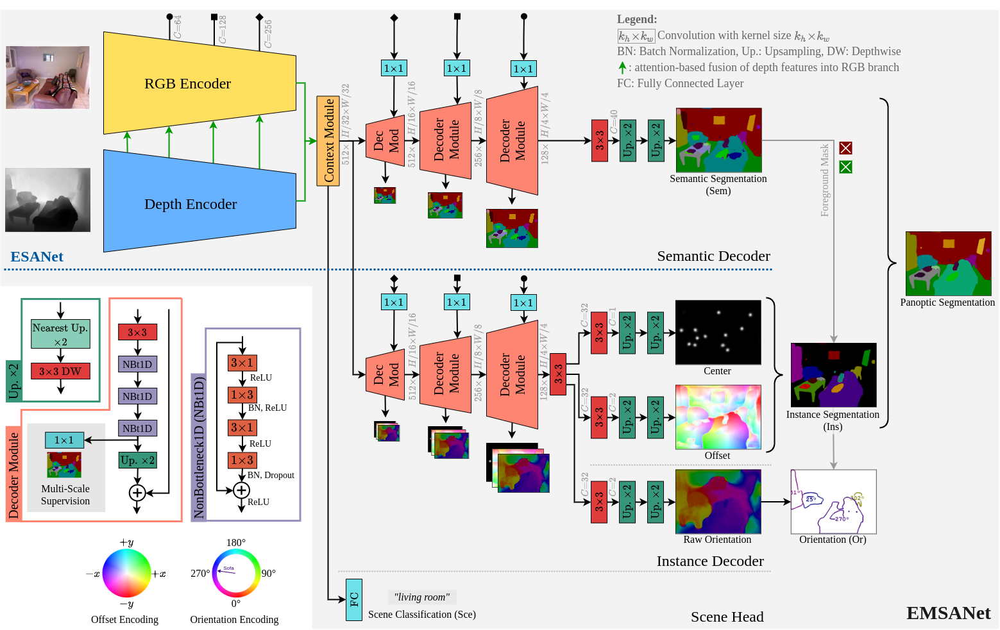
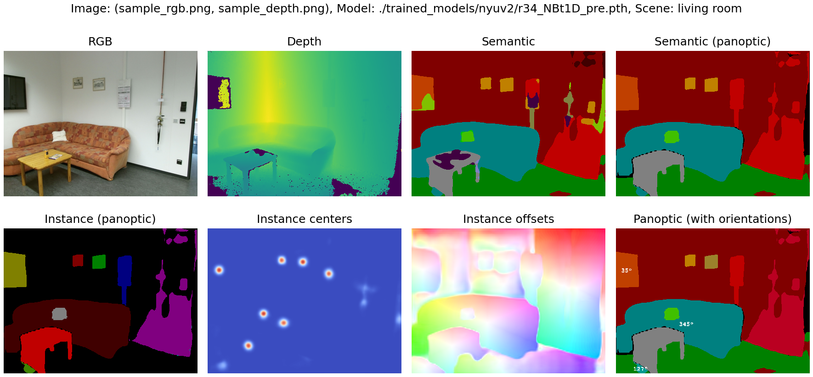
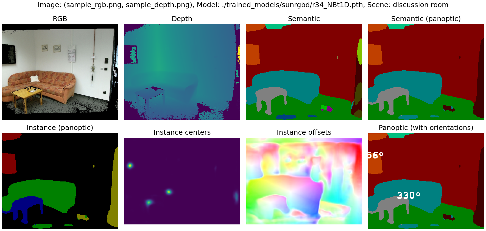

# EMSANet: Efficient Multi-Task RGB-D Scene Analysis for Indoor Environments

> 🔥 **2026-01-04**: updated to keep it working in 2026+ (see full [changelog](#changelog) below)

> [!TIP]
> You may also want to have a look at our follow-up works:  
• [EMSAFormer](https://github.com/TUI-NICR/EMSAFormer) [IJCNN 2023] – multi-task approach, better results for semantic segmentation, and cleaner and more extendable code base  
• [DVEFormer](https://github.com/TUI-NICR/DVEFormer) [IROS 2025] – efficient prediction of dense visual embeddings instead of fixed semantic classes for enhanced scene understanding  
• [SemanticNDT](https://github.com/TUI-NICR/semantic-mapping) [ICRA 2022] and [PanopticNDT](https://github.com/TUI-NICR/panoptic-mapping) [IROS 2023] – downstream application for semantic/panoptic mapping.

This repository contains the code to our paper "EMSANet: Efficient Multi-Task RGB-D Scene Analysis for Indoor 
Environments" ([IEEE Xplore](https://ieeexplore.ieee.org/document/9892852), [arXiv](https://arxiv.org/pdf/2207.04526.pdf))

Our efficient multi-task approach for RGB-D scene analysis (EMSANet) simultaneously performs semantic and instance 
segmentation (panoptic segmentation), instance orientation estimation, and scene classification.



This repository contains the code for training, evaluating, and applying our networks. Furthermore, we provide code 
for converting the model to ONNX and TensorRT, as well as for measuring the inference time.


## License and Citations
The source code is published under Apache 2.0 license, see [license file](LICENSE) for details.

If you use the source code or the network weights, please cite the following 
paper ([IEEE Xplore](https://ieeexplore.ieee.org/document/9892852), [arXiv](https://arxiv.org/pdf/2207.04526.pdf)):

> Seichter, D., Fischedick, S., Köhler, M., Gross, H.-M.
*Efficient Multi-Task RGB-D Scene Analysis for Indoor Environments*,
in IEEE International Joint Conference on Neural Networks (IJCNN), pp. 1-10, 2022.

<details>
<summary>BibTeX</summary>
 
```bibtex
@inproceedings{emsanet2022ijcnn,
    title     = {Efficient Multi-Task RGB-D Scene Analysis for Indoor Environments},
    author    = {Seichter, Daniel and Fischedick, S{\"o}hnke and K{\"o}hler, Mona and Gross, Horst-Michael},
    booktitle = {IEEE International Joint Conference on Neural Networks (IJCNN)},
    year      = {2022},
    volume    = {},
    number    = {},
    pages     = {1-10},
    doi       = {10.1109/IJCNN55064.2022.9892852}
}

@article{emsanet2022,
    title     = {Efficient Multi-Task RGB-D Scene Analysis for Indoor Environments},
    author    = {Seichter, Daniel and Fischedick, S{\"o}hnke and K{\"o}hler, Mona and Gross, Horst-Michael},
    journal   = {arXiv preprint arXiv:2207.04526},
    year      = {2022}
}
```

Note that the preprint was accepted to be published in IEEE International Joint 
Conference on Neural Networks (IJCNN) 2022.

</details>

This work is also embedded in a broader research context that is described in the corresponding PhD thesis:

> Seichter, D. *Szenen- und Umgebungsanalyse in der mobilen Assistenzrobotik*, Ilmenau, Germany, 2025,
  DOI: [10.22032/dbt.64081](https://doi.org/10.22032/dbt.64081).

The dissertation is written in German, but it can certainly be translated automatically. 😉

<details>
<summary>BibTeX</summary>

```bibtex
@phdthesis{seichter2025phd,
  author    = {Seichter, Daniel},
  title     = {Szenen- und Umgebungsanalyse in der mobilen Assistenzrobotik},
  year      = {2025},
  note      = {Dissertation, Technische Universit{\"a}t Ilmenau, 2024},
  doi       = {10.22032/dbt.64081},
  url       = {https://doi.org/10.22032/dbt.64081},
  language  = {de}
}
```

</details>

## Content
There are subsections for different things to do:
- [Installation](#installation): Set up the environment.
- [Results & Weights](#results--weights): Overview about major results and pretrained network weights.
- [Evaluation](#evaluation): Reproduce results reported in our paper.
- [Inference](#inference): Apply trained models.
    - [Dataset Inference](#dataset-inference): Apply trained model to samples from dataset.
    - [Sample Inference](#sample-inference): Apply trained model to samples in ./samples.
    - [Time Inference](#time-inference): Time inference on NVIDIA Jetson AGX Xavier using TensorRT.
- [Training](#training): Train new EMSANet model.
- [Changelog](#changelog): List of changes and updates made to the project.

## Installation
1. Clone repository:
    ```bash
    # do not forget the '--recursive'
    git clone --recursive https://github.com/TUI-NICR/EMSANet

    # navigate to the cloned directory (required for installing some dependencies and to run the scripts later)
    cd EMSANet
    ```

2. Create conda environment and install all dependencies:  
    **Option 1**: Updated environment from 2026 (Python 3.12, PyTorch 2.9.1):
    ```bash
    conda env create -f env_emsanet2026_mac.yaml  # macos with mps
    conda env create -f env_emsanet2026.yaml   # linux with cuda (sm_70 - sm_120)

    conda activate emsanet2026
    ```

    > Note that this environment also works with the latest releases of our follow-up works 
    [EMSAFormer](https://github.com/TUI-NICR/EMSAFormer) and 
    [PanopticNDT](https://github.com/TUI-NICR/panoptic-mapping/tree/release_2026_01_04).

    **Option 2**: Create your own conda environment:
    ```bash
    conda create --name "emsanet2026" python=3.12
    conda activate emsanet2026

    python -m pip install numpy opencv-python matplotlib tqdm
    python -m pip install torch torchvision
    python -m pip install torchmetrics
    python -m pip install wandb
    ```

    **Option 3**: Environment from 2023 - original publication of our follow-up work 
    [PanopticNDT](https://github.com/TUI-NICR/panoptic-mapping) (Python 3.8.16, PyTorch 1.13.0 (sm_37 - sm_86), see 
    `env_emsanet2023.yaml` for reference) - go back to
    [9d2ade4](https://github.com/TUI-NICR/EMSANet/tree/9d2ade475ba44c6bd82f6fac6d44ac82086bcd53) and follow the 
    instructions given there.
 
    > Note, as of 2025-01-01, the environment from 2023 still works. Consider installing the submodules
    (see step 3 below) with additional `--no-deps` option to skip installing too new dependencies.

    **Option 4**: Environment from 2022 - original publication (Python 3.8.13, PyTorch 1.10.1 (sm_37 - sm_80), see 
    `env_emsanet2022.yaml` for reference) - go back to
    [ff1d1ab](https://github.com/TUI-NICR/EMSANet/tree/ff1d1ab68e1bf386d081433c676d3a74d2beed71) and follow the 
    instructions given there.

    > Note that these environments do not include detectron2 that is required for ./external.

3. Install submodule packages:
    ```bash
    # dataset package
    python -m pip install -e "./lib/nicr-scene-analysis-datasets[withpreparation]"

    # multitask-scene-analysis package
    python -m pip install -e "./lib/nicr-multitask-scene-analysis"
    ```

4. Prepare datasets:  
    We trained our networks on 
    [NYUv2](https://cs.nyu.edu/~silberman/datasets/nyu_depth_v2.html), 
    [SUNRGB-D](https://rgbd.cs.princeton.edu/), and 
    [Hypersim](https://machinelearning.apple.com/research/hypersim). 

    Please follow the instructions given in `./lib/nicr-scene-analysis-datasets` or 
    [HERE](https://github.com/TUI-NICR/nicr-scene-analysis-datasets/tree/v0.8.3) to prepare the datasets. 
    In the following, we assume that they are stored at `./datasets`

    > ⚠️ Use `--instances-version emsanet` when preparing the SUNRGB-D dataset to reproduce reported paper results. 
    > See the notes in evaluation section for more details.

## Results & Weights
We provide the weights for our selected EMSANet-R34-NBt1D (with ResNet34 NBt1D backbones) on NYUv2 and SUNRGB-D*:

| Dataset                 | Model                             | mIoU  | mIoU** | PQ    | RQ    | SQ    | MAAE  | bAcc  | FPS*** | URL  |
|-------------------------|-----------------------------------|:-----:|:------:|:-----:|:-----:|:-----:|:-----:|:-----:|:-----:|------|
| NYUv2 (test)            | EMSANet-R34-NBt1D                 | 50.97 | 50.54  | 43.56 | 52.20 | 82.48 | 16.38 | 76.46 | 24.5  | [Download](https://drive.google.com/uc?id=1fqpj_d_VKsy38kU-X8bLmPK9664N-JaB) |
|                         | ESMANet-R34-NBt1D (pre. Hypersim) | 53.34 | 53.79  | 47.38 | 55.95 | 83.74 | 15.91 | 75.25 | 24.5  | [Download](https://drive.google.com/uc?id=1QbOJXVrOzsVM8ltX7AxqFSVLsY6vzvNX) |
| SUNRGB-D (test)         | EMSANet-R34-NBt1D                 | 48.39 | 45.56  | 50.15 | 58.14 | 84.85 | 14.24 | 61.83 | 24.5  | [Download](https://drive.google.com/uc?id=1Bonpax9TcTTbk0UH3NoVuNVlENCADc6f) |
|                         | EMSANet-R34-NBt1D (pre. Hypersim) | 48.47 | 44.18  | 52.84 | 60.67 | 86.01 | 14.10 | 57.22 | 24.5  | [Download](https://drive.google.com/uc?id=1LD4_g-jL4KJPRUmCGgXxx2xGQ7TNZ_o2) |

\* Note that the results will slightly differ if you run the evaluation on your own due to an unexpected overflow 
during panoptic merging that was fixed along with preparing the code for the release. However, the obtained results 
tend to be slightly better. For more details, see the [evaluation section](#evaluation) below.  
\*\* This mIoU is after merging the semantic and instance segmentation to the panoptic segmentation. Since merging is 
focused on instances, the mIoU might change slightly compared to the one obtained from semantic decoder.  
\*\*\* We report the FPS for an NVIDIA Jetson AGX Xavier (Jetpack 4.6, TensorRT 8, Float16) without postprocessing 
(as it is not optimized so far). Note that we only report the inference time for NYUv2 in our paper as it has more 
classes than SUNRGB-D. Thus, the FPS for SUNRGB-D can be slightly higher (37 vs. 40 classes).

We further provide the pre-training checkpoints we used for the mentioned 
"pre. Hypersim" results for [NYUv2](https://drive.google.com/uc?id=1toV2usF5Rj5CD28isbExGeand47nvg-2) and 
[SUNRGB-D](https://drive.google.com/uc?id=1mQkkVqT1le6C4mYfZBCdBsaK4o3w0DE0). 
Note that the training was done with additional normal estimation task.

Download and extract the models to `./trained_models`, or use the following commands:
```bash
python -m pip install gdown  # tested: gdown 5.2.0
cd ./trained_models

# NYUv2
gdown 1fqpj_d_VKsy38kU-X8bLmPK9664N-JaB  # nyuv2_r34_NBt1D.tar.gz
gdown 1QbOJXVrOzsVM8ltX7AxqFSVLsY6vzvNX  # nyuv2_r34_NBt1D_pre.tar.gz

# SUNRGB-D
gdown 1Bonpax9TcTTbk0UH3NoVuNVlENCADc6f  # sunrgbd_r34_NBt1D.tar.gz
gdown 1LD4_g-jL4KJPRUmCGgXxx2xGQ7TNZ_o2  # sunrgbd_r34_NBt1D_pre.tar.gz

# Hypersim pretraining
gdown 1toV2usF5Rj5CD28isbExGeand47nvg-2  # hypersim_r34_NBt1D_used_for_nyuv2.tar.gz
gdown 1mQkkVqT1le6C4mYfZBCdBsaK4o3w0DE0  # hypersim_r34_NBt1D_used_for_sunrgbd.tar.gz

# extract
find . -name "*.tar.gz" -exec tar -xvzf {} \;
```

> [!TIP] 
> Check out our follow-up works [EMSAFormer](https://github.com/TUI-NICR/EMSAFormer),
  [PanopticNDT](https://github.com/TUI-NICR/panoptic-mapping), and
  [DVEFormer](https://github.com/TUI-NICR/DVEFormer) for even better results and further experiments on the ScanNet 
  dataset.

## Evaluation
To reproduce results for the full multi-task approach, use `main.py` together 
with `--validation-only`.

> [!NOTE]
> Building the model correctly depends on the respective dataset and the tasks the model was trained on.

> [!NOTE]
> The results below slightly differ due to an unexpected overflow during panoptic merging that was fixed along with 
preparing the code for the release. However, the results below tend to be slightly better.  
On Apr 20, 2023, we further fixed a small bug in the instance task helper: the MAAE metric object was not reset after 
computing the metric value (at the end of an epoch), which led to wrong results for *valid_orientation_mae_gt_deg* in 
consecutive validations. The values reported below are fine as they were computed in a single validation run. However, 
the results reported in our paper slightly differ due the mentioned bug. Use the values below to compare to our 
approach.  
Finally, note that we observed that outputs of the instance decoder slightly vary depending on the hardware (gpu 
compute capability). The results below were obtained on a GPU with compute capability 7.5. You can check your gpu 
compute capability with: `nvidia-smi --query-gpu=compute_cap --format=csv,noheader`.

### NYUv2

To evaluate on NYUv2 (without pretraining on Hypersim), run:
```bash
python main.py \
    --dataset nyuv2 \
    --dataset-path ./datasets/nyuv2 \
    --tasks semantic scene instance orientation \
    --enable-panoptic \
    --input-modalities rgb depth \
    --rgb-encoder-backbone resnet34 \
    --rgb-encoder-backbone-block nonbottleneck1d \
    --depth-encoder-backbone resnet34 \
    --depth-encoder-backbone-block nonbottleneck1d \
    --no-pretrained-backbone \
    --weights-filepath ./trained_models/nyuv2/r34_NBt1D.pth \
    --checkpointing-metrics valid_semantic_miou bacc mae_gt_deg panoptic_deeplab_semantic_miou panoptic_all_deeplab_pq \
    --validation-batch-size 4 \
    --validation-only \
    --skip-sanity-check \
    --wandb-mode disabled
```
```text
Validation results:
{
...
'valid_instance_all_with_gt_deeplab_pq': tensor(0.6133, dtype=torch.float64),
...
'valid_orientation_mae_gt_deg': tensor(18.3723, dtype=torch.float64),
...
'valid_panoptic_all_with_gt_deeplab_pq': tensor(0.4359, dtype=torch.float64),
...
'valid_panoptic_all_with_gt_deeplab_rq': tensor(0.5223, dtype=torch.float64),
...
'valid_panoptic_all_with_gt_deeplab_sq': tensor(0.8248, dtype=torch.float64),
...
'valid_panoptic_deeplab_semantic_miou': tensor(0.5061),
...
'valid_panoptic_mae_deeplab_deg': tensor(16.3916, dtype=torch.float64),
...
'valid_scene_bacc': tensor(0.7646),
...
'valid_semantic_miou': tensor(0.5097),
...
}
```

To evaluate on NYUv2 (with pretraining on Hypersim), run:
```bash
python main.py \
    --dataset nyuv2 \
    --dataset-path ./datasets/nyuv2 \
    --tasks semantic scene instance orientation \
    --enable-panoptic \
    --input-modalities rgb depth \
    --rgb-encoder-backbone resnet34 \
    --rgb-encoder-backbone-block nonbottleneck1d \
    --depth-encoder-backbone resnet34 \
    --depth-encoder-backbone-block nonbottleneck1d \
    --no-pretrained-backbone \
    --weights-filepath ./trained_models/nyuv2/r34_NBt1D_pre.pth \
    --checkpointing-metrics valid_semantic_miou bacc mae_gt_deg panoptic_deeplab_semantic_miou panoptic_all_deeplab_pq \
    --validation-batch-size 4 \
    --validation-only \
    --skip-sanity-check \
    --wandb-mode disabled
```
```text
Validation results:
{
...
'valid_instance_all_with_gt_deeplab_pq': tensor(0.6441, dtype=torch.float64),
...
'valid_orientation_mae_gt_deg': tensor(18.0655, dtype=torch.float64),
...
'valid_panoptic_all_with_gt_deeplab_pq': tensor(0.4738, dtype=torch.float64),
...
'valid_panoptic_all_with_gt_deeplab_rq': tensor(0.5595, dtype=torch.float64),
...
'valid_panoptic_all_with_gt_deeplab_sq': tensor(0.8374, dtype=torch.float64),
...
'valid_panoptic_deeplab_semantic_miou': tensor(0.5380),
...
'valid_panoptic_mae_deeplab_deg': tensor(15.9024, dtype=torch.float64),
...
'valid_scene_bacc': tensor(0.7525),
...
'valid_semantic_miou': tensor(0.5334),
...
}
```

### SUNRGB-D

> [!CAUTION]
> We refactored and updated the instance annotation creation from 3D boxes for SUNRGB-D in 
  `nicr-scene-analysis-datasets` == 0.6.0. The resulting annotations feature a lot of more instances; however, it is 
  also changing the ground truth for the evaluation below. For more details and a comparison between both versions, we 
  refer to our follow-up work PanopticNDT([GitHub](https://github.com/TUI-NICR/panoptic-mapping), 
  [arXiv](https://arxiv.org/abs/2309.13635)) that proposes the refined annotations.
  To reproduce reported EMSANet paper results either use `nicr-scene-analysis-datasets` >= 0.7.0 and prepare the 
  SUNRGB-D dataset with `--instances-version emsanet` (or go back with both reposities and use 
  `nicr-scene-analysis-datasets` <= 0.6.0).  
  For backward compatibility, i.e., to still be able to load a SUNRGB-D dataset prepared with 
  `nicr-scene-analysis-datasets` < 0.7.0, you can pass `--sunrgbd-instances-version anyold` to `main.py`; however, use 
  this only if you know what you are doing!  
  We recommend re-preparing the SUNRGB-D dataset with `nicr-scene-analysis-datasets` >= 0.7.0 as described above to 
  avoid any confusion.


To evaluate on SUNRGB-D (without pretraining on Hypersim), run:
```bash
python main.py \
    --dataset sunrgbd \
    --dataset-path ./datasets/sunrgbd \
    --sunrgbd-instances-version emsanet \
    --sunrgbd-depth-do-not-force-mm \
    --tasks semantic scene instance orientation \
    --enable-panoptic \
    --input-modalities rgb depth \
    --rgb-encoder-backbone resnet34 \
    --rgb-encoder-backbone-block nonbottleneck1d \
    --depth-encoder-backbone resnet34 \
    --depth-encoder-backbone-block nonbottleneck1d \
    --no-pretrained-backbone \
    --weights-filepath ./trained_models/sunrgbd/r34_NBt1D.pth \
    --checkpointing-metrics valid_semantic_miou bacc mae_gt_deg panoptic_deeplab_semantic_miou panoptic_all_deeplab_pq \
    --validation-batch-size 4 \
    --validation-only \
    --skip-sanity-check \
    --wandb-mode disabled
```
```text
Validation results:
{
...
'valid_instance_all_with_gt_deeplab_pq': tensor(0.6062, dtype=torch.float64),
...
'valid_orientation_mae_gt_deg': tensor(16.2771, dtype=torch.float64),
...
'valid_panoptic_all_with_gt_deeplab_pq': tensor(0.4988, dtype=torch.float64),
...
'valid_panoptic_all_with_gt_deeplab_rq': tensor(0.5779, dtype=torch.float64),
...
'valid_panoptic_all_with_gt_deeplab_sq': tensor(0.8491, dtype=torch.float64),
...
'valid_panoptic_deeplab_semantic_miou': tensor(0.4553),
...
'valid_panoptic_mae_deeplab_deg': tensor(14.2271, dtype=torch.float64),
...
'valid_scene_bacc': tensor(0.6176),
...
'valid_semantic_miou': tensor(0.4839),
...
}
```

To evaluate on SUNRGB-D (with pretraining on Hypersim), run:
```bash
python main.py \
    --dataset sunrgbd \
    --dataset-path ./datasets/sunrgbd \
    --sunrgbd-instances-version emsanet \
    --sunrgbd-depth-do-not-force-mm \
    --tasks semantic scene instance orientation \
    --enable-panoptic \
    --input-modalities rgb depth \
    --rgb-encoder-backbone resnet34 \
    --rgb-encoder-backbone-block nonbottleneck1d \
    --depth-encoder-backbone resnet34 \
    --depth-encoder-backbone-block nonbottleneck1d \
    --no-pretrained-backbone \
    --weights-filepath ./trained_models/sunrgbd/r34_NBt1D_pre.pth \
    --checkpointing-metrics valid_semantic_miou bacc mae_gt_deg panoptic_deeplab_semantic_miou panoptic_all_deeplab_pq \
    --validation-batch-size 4 \
    --validation-only \
    --skip-sanity-check \
    --wandb-mode disabled
```
```text
Validation results:
{
...
'valid_instance_all_with_gt_deeplab_pq': tensor(0.6426, dtype=torch.float64),
...
'valid_orientation_mae_gt_deg': tensor(16.2224, dtype=torch.float64),
...
'valid_panoptic_all_with_gt_deeplab_pq': tensor(0.5270, dtype=torch.float64),
...
'valid_panoptic_all_with_gt_deeplab_rq': tensor(0.6048, dtype=torch.float64),
...
'valid_panoptic_all_with_gt_deeplab_sq': tensor(0.8602, dtype=torch.float64),
...
'valid_panoptic_deeplab_semantic_miou': tensor(0.4415),
...
'valid_panoptic_mae_deeplab_deg': tensor(14.1031, dtype=torch.float64),
...
'valid_scene_bacc': tensor(0.5722),
...
'valid_semantic_miou': tensor(0.4847),
...
}
```

## Inference
We provide scripts for inference on both samples drawn from one of our used datasets (`main.py` with additional 
arguments) and samples located in `./samples` (`inference_samples.py`). 

> [!NOTE]
> Building the model correctly depends on the respective dataset the model was trained on.

### Dataset Inference
To run inference on a dataset with the full multi-task approach, use `main.py` together with `--validation-only` 
and `--visualize-validation`. 
By default the visualized outputs are written to a newly created directory next to the weights. 
However, you can also specify the output path with `--visualization-output-path`.

Example: To apply EMSANet-R34-NBt1D trained on NYUv2 to samples from NYUv2, run:
```bash
python main.py \
    --dataset nyuv2 \
    --dataset-path ./datasets/nyuv2 \
    --tasks semantic scene instance orientation \
    --enable-panoptic \
    --input-modalities rgb depth \
    --rgb-encoder-backbone resnet34 \
    --rgb-encoder-backbone-block nonbottleneck1d \
    --depth-encoder-backbone resnet34 \
    --depth-encoder-backbone-block nonbottleneck1d \
    --no-pretrained-backbone \
    --weights-filepath ./trained_models/nyuv2/r34_NBt1D.pth \
    --validation-batch-size 4 \
    --validation-only \
    --visualize-validation \
    --visualization-output-path ./visualized_outputs/nyuv2 \
    --skip-sanity-check \
    --wandb-mode disabled
```
Similarly, the same can be applied to SUNRGB-D (see parameters in [evaluation section](#evaluation)).

### Sample Inference
Use `inference_samples.py` to apply a trained model to the sample from a Kinect v2 given in `./samples`.

> [!NOTE]
> The dataset argument is required to determine the correct dataset configuration (classes, colors, ...) and to build 
the model correctly. However, you do not need to prepare the respective dataset.  
Furthermore, depending on the given depth images and the used dataset for training, an additional depth scaling might 
be necessary. The provided example depth image is in millimeters (1m equals to a depth value of 1000).

Examples: 
- To apply our EMSANet-R34-NBt1D trained on NYUv2 to the samples, run:
    ```bash
    python inference_samples.py \
        --dataset nyuv2 \
        --tasks semantic scene instance orientation \
        --enable-panoptic \
        --rgb-encoder-backbone resnet34 \
        --rgb-encoder-backbone-block nonbottleneck1d \
        --depth-encoder-backbone resnet34 \
        --depth-encoder-backbone-block nonbottleneck1d \
        --no-pretrained-backbone \
        --input-modalities rgb depth \
        --raw-depth \
        --depth-max 10000 \
        --depth-scale 1 \
        --instance-offset-distance-threshold 40 \
        --weights-filepath ./trained_models/nyuv2/r34_NBt1D_pre.pth
    ```
    

- To apply our EMSANet-R34-NBt1D trained on SUNRGB-D to the samples, run:
    ```bash
    python inference_samples.py \
        --dataset sunrgbd \
        --sunrgbd-depth-do-not-force-mm \
        --tasks semantic scene instance orientation \
        --enable-panoptic \
        --rgb-encoder-backbone resnet34 \
        --rgb-encoder-backbone-block nonbottleneck1d \
        --depth-encoder-backbone resnet34 \
        --depth-encoder-backbone-block nonbottleneck1d \
        --no-pretrained-backbone \
        --input-modalities rgb depth \
        --raw-depth \
        --depth-max 8000 \
        --depth-scale 8 \
        --instance-offset-distance-threshold 40 \
        --weights-filepath ./trained_models/sunrgbd/r34_NBt1D.pth
    ```
    

> [!NOTE]
> The models are not trained on that kind of incomplete depth images. Moreover, training on NYUv2 means that no images 
from Kinect v2 were present at all (NYUv2 is Kinect (v1) only).

> [!TIP]
> The `--instance-offset-distance-threshold` argument is used to assign an instance ID of 0 to pixels if they have a 
distance greater than 40 pixels from the nearest center. During panoptic merging, these pixels are assigned to the 
void class.

### Time Inference

> [!TIP]
> Newer versions of TensorRT `onnx2trt` is not required (and also not available) anymore. 
Pass `--trt-use-get-engine-v2` to `inference_time_whole_model.py` to use TensoRT's Python API instead.

We timed the inference on an NVIDIA Jetson AGX Xavier with Jetpack 4.6 (TensorRT 8.0.1.6, PyTorch 1.10.0).
See the corresponding [PhD thesis](#license-and-citations) above for more recent timing results.

Reproducing the timings on an NVIDIA Jetson AGX Xavier further requires:
- [the PyTorch 1.10.0 wheel](https://nvidia.box.com/shared/static/fjtbno0vpo676a25cgvuqc1wty0fkkg6.whl) from [NVIDIA Forum](https://forums.developer.nvidia.com/t/pytorch-for-jetson-version-1-10-now-available/72048) (see the instruction to install TorchVision 0.11.1 as well)
- [the NVIDIA TensorRT Open Source Software](https://github.com/NVIDIA/TensorRT/tree/8.0.1) (`onnx2trt` is used to convert the onnx model to a TensorRT engine) 
- the requirements and instructions listed below:
    ```bash
    # do not use numpy>=1.19.4 or add to .bashrc "export OPENBLAS_CORETYPE=ARMV8"
    pip3 install -U numpy<=1.19

    # pycuda
    sudo ln -s /usr/include/locale.h /usr/include/xlocale.h
    pip3 install pycuda>=2021.1

    # remaining dependencies
    pip3 install dataclasses==0.8
    pip3 install protobuf==3.19.3
    pip3 install termcolor==1.1.0
    pip3 install 'tqdm>=4.62.3'
    pip3 install torchmetrics==0.6.2

    # for visualization to fix "ImportError: The _imagingft C module is not installed"
    sudo apt-get install libfreetype6-dev
    pip3 uninstall pillow
    pip3 install --no-cache-dir pillow

    # packages included as submodules in this repository
    pip install -e ./lib/nicr-scene-analysis-datasets
    pip install -e ./lib/nicr-multitask-scene-analysis
    ```

Subsequently, you can run `inference_time.bash` to reproduce the reported timings.

## Training
Use `main.py` to train EMSANet on NYUv2, SUNRGB-D, Hypersim, or any other dataset that you implemented following 
the implementation of the provided datasets.

> [!NOTE]
> Training EMSANet-R34-NBt1D requires the pretrained weights for the encoder backbone ResNet-34 NBt1D. You can download
our pretrained weights on ImageNet from [Link](https://drive.google.com/uc?id=10IVoHgRqXLslYdzMNYKAkYHcJdqsk4BT).

```bash
python -m pip install gdown  # tested: gdown 5.2.0
cd ./trained_models

# ImageNet pretrained weights
gdown 10IVoHgRqXLslYdzMNYKAkYHcJdqsk4BT  # imagenet_r34_NBt1D.tar.gz
tar -xvzf imagenet_r34_NBt1D.tar.gz
```

> [!NOTE]
> We trained all models on NVIDIA A100-SXM4-40GB GPUs with batch size of 8. However, training the full multi-task 
approach requires only ~14GB of VRAM, so a smaller GPU may also be fine. We did not observe any great boost from larger 
batch sizes.

Example: Train our full multi-task EMSANet-R34-NBt1D on NYUv2:
```bash
python main.py \
    --results-basepath ./results \
    --dataset nyuv2 \
    --dataset-path ./datasets/nyuv2 \
    --input-modalities rgb depth \
    --tasks semantic scene instance orientation \
    --enable-panoptic \
    --tasks-weighting 1.0 0.25 3.0 0.5 \
    --instance-weighting 2 1 \
    --rgb-encoder-backbone resnet34 \
    --rgb-encoder-backbone-block nonbottleneck1d \
    --depth-encoder-backbone resnet34 \
    --depth-encoder-backbone-block nonbottleneck1d \
    --encoder-backbone-pretrained-weights-filepath ./trained_models/imagenet/r34_NBt1D.pth \
    --validation-batch-size 16 \
    --validation-skip 0.0 \
    --checkpointing-skip 0.8 \
    --checkpointing-best-only \
    --checkpointing-metrics valid_semantic_miou bacc mae_gt_deg panoptic_deeplab_semantic_miou panoptic_all_with_gt_deeplab_pq \
    --batch-size 8 \
    --learning-rate 0.03 \
    --wandb-mode disabled
```

> [!TIP]
> Panoptic merging and computing all metrics during validation is time-consuming. To speed up training, have a look at
`--validation-skip` and `--validation-force-interval` to reduce the number of validation runs during training.

> [!CAUTION]
> To reproduce the results reported in our paper for SUNRGB-D, make sure to prepare and use the correct dataset 
version for SUNRGB-D (see note in [evaluation section](#sunrgb-d)).

For more options, we refer to `./emsanet/args.py` or simply run:

```bash
python main.py --help
```

## Changelog

> [!NOTE]
> Most relevant changes are listed below. Note that backward compatibility might be broken. 
  However, compatibility to original publication is retained.

**Jan 04, 2026**
- add more recent environment (`env_emsanet2026.yaml` and `env_emsanet2026_mac.yaml`) with Python 3.12 and latest 
  tested PyTorch 2.9.1
- remove old environment files, only point to relevant commit hashes for original publication (2022) and follow-up work 
  PanopticNDT (2023)
- use ruff for linting
- bump `lib/nicr-scene-analysis-datasets` to version 0.8.3
- bump `lib/nicr-multitask-scene-analysis` to version 0.3.1
- fix off by one issue for `--validation-force-interval` argument and force validation at the end of training

**Jun 27, 2024**
- add more recent and thinned-out environment (`emsanet_environment_2024.yml`) 
  with Python 3.11 and latest tested PyTorch 2.3
- add support for MPS device (see `--device` argument in `emsanet/args.py`):
    - only tested for inference
    - might be slower as not all instance postprocessing operations are 
      supported yet (we use some CPU fallbacks)
- add support for CPU device (see `--device` argument in `emsanet/args.py`)
- fix bug in visualization (only with MPS/CPU device)
- visualize ground truth in fullres as well
- visualize semantic and instance of ground-truth panoptic separately
- some doc string fixes
- dump instance meta dicts as well when visualizing validation
- add possibility to visualize side outputs during validation
- bump `lib/nicr-scene-analysis-datasets` to version 0.7.0
- bump `lib/nicr-multitask-scene-analysis` to version 0.2.3
- minor fix in `inference_time_whole_model.py`
- enable weight loading for single-task semantic (similar to ESANet) from 
  multi-task checkpoint (e.g., trained EMSANet)
- align branches for EMSANet (this repository) and follow-up work Panoptic 
  Mapping ([see here](https://github.com/TUI-NICR/panoptic-mapping)) - only
  one main branch but different versions for SUNRGB-D instances

**Sep 23, 2023**
- small fix in dataset path parsing (do not force lower case)
- add `disable-progress-bars` argument to `main.py`
- individual subset selection with `--subset-train` argument in `main.py`
- enable loading weights from (pre-)training with orientation task
- bump `nicr-scene-analysis-datasets` to version 0.5.6
- bump `nicr-multitask-scene-analysis` to version 0.2.2
- decrease default validation batch size from 16 to 4 in examples to enable 
  out-of-the-box execution on smaller GPUs

**Jun 08, 2023**
- update sample image (depth in mm, RGB without registration artefacts)
- bump `nicr-scene-analysis-datasets` to version 0.5.4

**Apr 20, 2023**
- bump `nicr-multitask-scene-analysis` to version 0.2.1 to fix a small bug in 
  the instance task helper: the MAAE metric object was not reset after 
  computing the metric value (at the end of an epoch) - 
  see [evaluation section](#evaluation) for more details

**Mar 29, 2023**
- bump `nicr-scene-analysis-datasets` to version 0.5.2
- bump `nicr-multitask-scene-analysis` to version 0.2.0
- refactor `args.py` (backward compatible)
- add support MLP-based decoders (SegFormer-like)
- add support RGB-D modality (RGB and depth concatenated as 4 channels inputs)
- add script for dataset inference `inference_dataset.py` for ScanNet 
  benchmark and semantic/panoptic mapping
- add support for ScanNet dataset
- add support for concatenated datasets, e.g., SUNRGB-D and ScanNet
- refactor batch and prediction visualization
- add support for AdamW and RAdam optimizer
- add conda environment for PyTorch 1.13 (PyTorch 2 should also work)
- add support for TensorRT engine creation with Python API instead of `onnx2trt`

**May 11, 2022**
- initial code release for original publication (last revision ff1d1ab68e1bf386d081433c676d3a74d2beed71)
