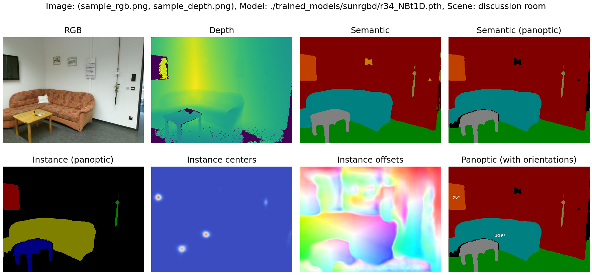

# EMSANet: Efficient Multi-Task RGB-D Scene Analysis for Indoor Environments

[](https://paperswithcode.com/sota/semantic-segmentation-on-nyu-depth-v2?p=efficient-multi-task-rgb-d-scene-analysis-for)
[](https://paperswithcode.com/sota/semantic-segmentation-on-sun-rgbd?p=efficient-multi-task-rgb-d-scene-analysis-for)

[](https://paperswithcode.com/sota/panoptic-segmentation-on-nyu-depth-v2?p=efficient-multi-task-rgb-d-scene-analysis-for)
[](https://paperswithcode.com/sota/panoptic-segmentation-on-sun-rgbd?p=efficient-multi-task-rgb-d-scene-analysis-for)

[](https://paperswithcode.com/sota/scene-classification-unified-classes-on-nyu?p=efficient-multi-task-rgb-d-scene-analysis-for)
[](https://paperswithcode.com/sota/scene-classification-unified-classes-on-sun?p=efficient-multi-task-rgb-d-scene-analysis-for)

This repository contains the code to our paper "EMSANet: Efficient Multi-Task 
RGB-D Scene Analysis for Indoor Environments" ([IEEE Xplore](https://ieeexplore.ieee.org/document/9892852), [arXiv](https://arxiv.org/pdf/2207.04526.pdf))

Our efficient multi-task approach for RGB-D scene analysis (EMSANet) 
simultaneously performs semantic and instance segmentation (panoptic 
segmentation), instance orientation estimation, and scene classification.


This repository contains the code for training, evaluating, and applying our 
networks. Furthermore, we provide code for converting the model to ONNX and 
TensorRT, as well as for measuring the inference time.


## License and Citations
The source code is published under Apache 2.0 license, see 
[license file](LICENSE) for details.

If you use the source code or the network weights, please cite the following 
paper ([IEEE Xplore](https://ieeexplore.ieee.org/document/9892852), [arXiv](https://arxiv.org/pdf/2207.04526.pdf)):

> Seichter, D., Fischedick, B., Köhler, M., Gross, H.-M.
*Efficient Multi-Task RGB-D Scene Analysis for Indoor Environments*,
in IEEE International Joint Conference on Neural Networks (IJCNN), pp. 1-10, 2022.

```bibtex
@inproceedings{emsanet2022ijcnn,
  title={Efficient Multi-Task RGB-D Scene Analysis for Indoor Environments},
  author={Seichter, Daniel and Fischedick, S{\"o}hnke and K{\"o}hler, Mona and Gross, Horst-Michael},
  booktitle={IEEE International Joint Conference on Neural Networks (IJCNN)},
  year={2022},
  volume={},
  number={},
  pages={1-10},
  doi={10.1109/IJCNN55064.2022.9892852}
}

@article{emsanet2022,
  title={Efficient Multi-Task RGB-D Scene Analysis for Indoor Environments},
  author={Seichter, Daniel and Fischedick, S{\"o}hnke and K{\"o}hler, Mona and Gross, Horst-Michael},
  journal={arXiv preprint arXiv:2207.04526},
  year={2022}
}
```
Note that the preprint was accepted to be published in IEEE International Joint 
Conference on Neural Networks (IJCNN) 2022.


## Content
There are subsection for different things to do:
- [Installation](#installation): Set up the environment.
- [Results & Weights](#results--weights): Overview about major results and pretrained network weights.
- [Evaluation](#evaluation): Reproduce results reported in our paper.
- [Inference](#inference): Apply trained models.
    - [Dataset Inference](#dataset-inference): Apply trained model to samples from dataset.
    - [Sample Inference](#sample-inference): Apply trained model to samples in ./samples.
    - [Time Inference](#time-inference): Time inference on NVIDIA Jetson AGX Xavier using TensorRT.
- [Training](#training): Train new EMSANet model.


## Installation
1. Create conda environment and install all dependencies:
    ```bash
    # option 1: create conda environment from provided YAML file
    # note that this environment does not include detectron2 that is required for ./external
    conda env create -f multi_task_environment.yml
    conda activate multitask
    ```

    ```bash
    # option 2: create new conda environment manually
    conda create -n multitask python=3.8 anaconda
    conda activate multitask

    # remaining conda dependencies
    conda install pytorch=1.10.1 torchvision=0.11.2 cudatoolkit=11.3 -c pytorch

    # remaining pip dependencies
    pip install 'opencv-python>=4.2.0.34'    # newer versions may work as well
    pip install torchmetrics==0.6.2
    pip install wandb==0.12.9

    # optional dependencies
    # -> test dependencies and ./external only
    conda install 'protobuf<=3.19.1'    # for onnx
    pip install onnx==1.11.0
    pip install git+https://github.com/cocodataset/panopticapi.git
    # -> for ./external only
    # see: https://detectron2.readthedocs.io/en/latest/tutorials/install.html)
    python -m pip install detectron2 -f https://dl.fbaipublicfiles.com/detectron2/wheels/cpu/torch1.10/index.html
    ```

2. Clone repository and install submodule packages:
    ```bash
    # do not forget the '--recursive' ;)
    git clone --recursive https://github.com/TUI-NICR/EMSANet

    # navigate to the cloned directory (required for installing some dependencies and to run the scripts later)
    cd EMSANet

    # dataset package
    pip install -e ./lib/nicr-scene-analysis-datasets[with_preparation]

    # multitask scene analysis package
    pip install -e ./lib/nicr-multitask-scene-analysis
    ```

3. Prepare datasets:  
    We trained our networks on 
    [NYUv2](https://cs.nyu.edu/~silberman/datasets/nyu_depth_v2.html), 
    [SUNRGB-D](https://rgbd.cs.princeton.edu/), and [Hypersim](nicr_scene_analysis_datasets/datasets/hypersim). 

    Please follow the instructions given in `./lib/nicr-scene-analysis-datasets` or [HERE](https://github.com/TUI-NICR/nicr-scene-analysis-datasets/tree/ca73dc8f4976647fbd1c2da54ca7a31ccd1bea98) to prepare the datasets. 
    In the following, we assume that they are stored at `./datasets`


## Results & Weights
We provide the weights for our selected EMSANet-R34-NBt1D (with ResNet34 NBt1D backbones) on NYUv2 and SUNRGB-D*:

| Dataset                 | Model                             | mIoU  | mIoU** | PQ    | RQ    | SQ    | MAAE  | bAcc  | FPS*** | URL  |
|-------------------------|-----------------------------------|:-----:|:------:|:-----:|:-----:|:-----:|:-----:|:-----:|:-----:|------|
| NYUv2 (test)            | EMSANet-R34-NBt1D                 | 50.97 | 50.54  | 43.56 | 52.20 | 82.48 | 16.38 | 76.46 | 24.5  | [Download](https://drive.google.com/uc?id=1fqpj_d_VKsy38kU-X8bLmPK9664N-JaB) |
|                         | ESMANet-R34-NBt1D (pre. Hypersim) | 53.34 | 53.79  | 47.38 | 55.95 | 83.74 | 15.91 | 75.25 | 24.5  | [Download](https://drive.google.com/uc?id=1QbOJXVrOzsVM8ltX7AxqFSVLsY6vzvNX) |
| SUNRGB-D (test)         | EMSANet-R34-NBt1D                 | 48.39 | 45.56  | 50.15 | 58.14 | 84.85 | 14.24 | 61.83 | 24.5  | [Download](https://drive.google.com/uc?id=1Bonpax9TcTTbk0UH3NoVuNVlENCADc6f) |
|                         | EMSANet-R34-NBt1D (pre. Hypersim) | 48.47 | 44.18  | 52.84 | 60.67 | 86.01 | 14.10 | 57.22 | 24.5  | [Download](https://drive.google.com/uc?id=1LD4_g-jL4KJPRUmCGgXxx2xGQ7TNZ_o2) |

\* Note that the results will slightly differ if you run the evaluation on your 
own due to an unexpected overflow during panoptic merging that was fixed along 
with preparing the code for the release. However, the obtained results tend to 
be slightly better. For more details, see the 
[evaluation section](#evaluation) below.  
\*\* This mIoU is after merging the semantic and instance segmentation to the 
panoptic segmentation. Since merging is focused on instances, the mIoU might 
change slightly compared to the one obtained from semantic decoder.  
\*\*\* We report the FPS for an NVIDIA Jetson AGX Xavier (Jetpack 4.6, 
TensorRT 8, Float16) without postprocessing (as it is not optimized so far). 
Note that we only report the inference time for NYUv2 in our paper as it has 
more classes than SUNRGB-D. Thus, the FPS for SUNRGB-D can be slightly higher 
(37 vs. 40 classes).

We further provide the pre-training checkpoints we used for the mentioned 
"pre. Hypersim" results for [NYUv2](https://drive.google.com/uc?id=1toV2usF5Rj5CD28isbExGeand47nvg-2) and 
[SUNRGB-D](https://drive.google.com/uc?id=1mQkkVqT1le6C4mYfZBCdBsaK4o3w0DE0). 
Note that the training was done with additional normal estimation task.

Download and extract the models to `./trained_models`.


## Evaluation
To reproduce results for the full multi-task approach, use `main.py` together 
with `--validation-only`.

> Note that building the model correctly depends on the respective dataset and 
the tasks the model was trained on.

> Note that the results below slightly differ due to an unexpected overflow 
during panoptic merging that was fixed along with preparing the code for the 
release. However, the results below tend to be slightly better.


To evaluate on NYUv2 (without pretraining on Hypersim), run:
```bash
python main.py \
    --dataset nyuv2 \
    --dataset-path ./datasets/nyuv2 \
    --tasks semantic scene instance orientation \
    --enable-panoptic \
    --input-modalities rgb depth \
    --rgb-encoder-backbone resnet34 \
    --rgb-encoder-backbone-block nonbottleneck1d \
    --depth-encoder-backbone resnet34 \
    --depth-encoder-backbone-block nonbottleneck1d \
    --no-pretrained-backbone \
    --weights-filepath ./trained_models/nyuv2/r34_NBt1D.pth \
    --checkpointing-metrics valid_semantic_miou bacc mae_gt_deg panoptic_deeplab_semantic_miou panoptic_all_deeplab_pq \
    --validation-batch-size 16 \
    --validation-only \
    --skip-sanity-check \
    --wandb-mode disabled
````
```text
Validation results:
{
...
'valid_instance_all_with_gt_deeplab_pq': tensor(0.6133, dtype=torch.float64),
...
'valid_orientation_mae_gt_deg': tensor(18.3723, dtype=torch.float64),
...
'valid_panoptic_all_with_gt_deeplab_pq': tensor(0.4359, dtype=torch.float64),
...
'valid_panoptic_stuff_deeplab_rq': tensor(0.8498, dtype=torch.float64),
...
'valid_panoptic_stuff_deeplab_sq': tensor(0.8605, dtype=torch.float64),
...
'valid_panoptic_deeplab_semantic_miou': tensor(0.5061),
...
'valid_panoptic_mae_deeplab_deg': tensor(16.3916, dtype=torch.float64),
...
'valid_scene_bacc': tensor(0.7646),
...
'valid_semantic_miou': tensor(0.5097),
...
}
```

To evaluate on NYUv2 (with pretraining on Hypersim), run:
```bash
python main.py \
    --dataset nyuv2 \
    --dataset-path ./datasets/nyuv2 \
    --tasks semantic scene instance orientation \
    --enable-panoptic \
    --input-modalities rgb depth \
    --rgb-encoder-backbone resnet34 \
    --rgb-encoder-backbone-block nonbottleneck1d \
    --depth-encoder-backbone resnet34 \
    --depth-encoder-backbone-block nonbottleneck1d \
    --no-pretrained-backbone \
    --weights-filepath ./trained_models/nyuv2/r34_NBt1D_pre.pth \
    --checkpointing-metrics valid_semantic_miou bacc mae_gt_deg panoptic_deeplab_semantic_miou panoptic_all_deeplab_pq \
    --validation-batch-size 16 \
    --validation-only \
    --skip-sanity-check \
    --wandb-mode disabled
````
```text
Validation results:
{
...
'valid_instance_all_with_gt_deeplab_pq': tensor(0.6441, dtype=torch.float64),
...
'valid_orientation_mae_gt_deg': tensor(18.0655, dtype=torch.float64),
...
'valid_panoptic_all_with_gt_deeplab_pq': tensor(0.4738, dtype=torch.float64),
...
'valid_panoptic_stuff_deeplab_rq': tensor(0.5595, dtype=torch.float64),
...
'valid_panoptic_stuff_deeplab_sq': tensor(0.8374, dtype=torch.float64),
...
'valid_panoptic_deeplab_semantic_miou': tensor(0.5380),
...
'valid_panoptic_mae_deeplab_deg': tensor(15.9024, dtype=torch.float64),
...
'valid_scene_bacc': tensor(0.7525),
...
'valid_semantic_miou': tensor(0.5334),
...
}
```
    
To evaluate on SUNRGB-D (without pretraining on Hypersim), run:
```bash
python main.py \
    --dataset sunrgbd \
    --dataset-path ./datasets/sunrgbd \
    --tasks semantic scene instance orientation \
    --enable-panoptic \
    --input-modalities rgb depth \
    --rgb-encoder-backbone resnet34 \
    --rgb-encoder-backbone-block nonbottleneck1d \
    --depth-encoder-backbone resnet34 \
    --depth-encoder-backbone-block nonbottleneck1d \
    --no-pretrained-backbone \
    --weights-filepath ./trained_models/sunrgbd/r34_NBt1D.pth \
    --checkpointing-metrics valid_semantic_miou bacc mae_gt_deg panoptic_deeplab_semantic_miou panoptic_all_deeplab_pq \
    --validation-batch-size 16 \
    --validation-only \
    --skip-sanity-check \
    --wandb-mode disabled
````
```text
Validation results:
{
...
'valid_instance_all_with_gt_deeplab_pq': tensor(0.6062, dtype=torch.float64),
...
'valid_orientation_mae_gt_deg': tensor(16.2771, dtype=torch.float64),
...
'valid_panoptic_all_with_gt_deeplab_pq': tensor(0.4988, dtype=torch.float64),
...
'valid_panoptic_stuff_deeplab_rq': tensor(0.5779, dtype=torch.float64),
...
'valid_panoptic_stuff_deeplab_sq': tensor(0.8491, dtype=torch.float64),
...
'valid_panoptic_deeplab_semantic_miou': tensor(0.4553),
...
'valid_panoptic_mae_deeplab_deg': tensor(14.2271, dtype=torch.float64),
...
'valid_scene_bacc': tensor(0.6176),
...
'valid_semantic_miou': tensor(0.4839),
...
}
```

To evaluate on SUNRGB-D (with pretraining on Hypersim), run:
```bash
python main.py \
    --dataset sunrgbd \
    --dataset-path ./datasets/sunrgbd \
    --tasks semantic scene instance orientation \
    --enable-panoptic \
    --input-modalities rgb depth \
    --rgb-encoder-backbone resnet34 \
    --rgb-encoder-backbone-block nonbottleneck1d \
    --depth-encoder-backbone resnet34 \
    --depth-encoder-backbone-block nonbottleneck1d \
    --no-pretrained-backbone \
    --weights-filepath ./trained_models/sunrgbd/r34_NBt1D_pre.pth \
    --checkpointing-metrics valid_semantic_miou bacc mae_gt_deg panoptic_deeplab_semantic_miou panoptic_all_deeplab_pq \
    --validation-batch-size 16 \
    --validation-only \
    --skip-sanity-check \
    --wandb-mode disabled
````
```text
Validation results:
{
...
'valid_instance_all_with_gt_deeplab_pq': tensor(0.6426, dtype=torch.float64),
...
'valid_orientation_mae_gt_deg': tensor(16.2224, dtype=torch.float64),
...
'valid_panoptic_all_with_gt_deeplab_pq': tensor(0.5270, dtype=torch.float64),
...
'valid_panoptic_stuff_deeplab_rq': tensor(0.6048, dtype=torch.float64),
...
'valid_panoptic_stuff_deeplab_sq': tensor(0.8602, dtype=torch.float64),
...
'valid_panoptic_deeplab_semantic_miou': tensor(0.4415),
...
'valid_panoptic_mae_deeplab_deg': tensor(14.1031, dtype=torch.float64),
...
'valid_scene_bacc': tensor(0.5722),
...
'valid_semantic_miou': tensor(0.4847),
...
}
```


## Inference
We provide scripts for inference on both samples drawn from one of our used 
datasets (`main.py` with additional arguments) and samples located in 
`./samples` (`inference_samples.py`). 

> Note that building the model correctly depends on the respective dataset the 
model was trained on.

### Dataset Inference
To run inference on a dataset with the full multi-task approach, use `main.py` 
together with `--validation-only` and `--visualize-validation`.
By default the visualized outputs are written to a newly created directory next 
to the weights. However, you can also specify the output path with 
`--visualization-output-path`.

Example: To apply EMSANet-R34-NBt1D trained on NYUv2 to samples from NYUv2, run:
```bash
python main.py \
    --dataset nyuv2 \
    --dataset-path ./datasets/nyuv2 \
    --tasks semantic scene instance orientation \
    --enable-panoptic \
    --input-modalities rgb depth \
    --rgb-encoder-backbone resnet34 \
    --rgb-encoder-backbone-block nonbottleneck1d \
    --depth-encoder-backbone resnet34 \
    --depth-encoder-backbone-block nonbottleneck1d \
    --no-pretrained-backbone \
    --weights-filepath ./trained_models/nyuv2/r34_NBt1D.pth \
    --validation-batch-size 16 \
    --validation-only \
    --visualize-validation \
    --visualization-output-path ./visualized_outputs/nyuv2 \
    --skip-sanity-check \
    --wandb-mode disabled
```
Similarly, the same can be applied to SUNRGB-D 
(see parameters in [evaluation](#evaluation) section).

### Sample Inference
Use `inference_samples.py` to apply a trained model to the sample from a 
Kinect v2 given in `./samples`.

> Note that the dataset argument is required to determine the correct dataset
configuration (classes, colors, ...) and to build the model correctly. 
However, you do not need to prepare the respective dataset.
Furthermore, depending on the given depth images and the 
used dataset for training, an additional depth scaling might be necessary. 
The provided example depth image is in 1/10 millimeters (1m equals to a depth 
value of 10000).

Examples: 
- To apply our EMSANet-R34-NBt1D trained on NYUv2 to the samples, run:
    ```bash
    python inference_samples.py \
        --dataset nyuv2 \
        --tasks semantic scene instance orientation \
        --enable-panoptic \
        --rgb-encoder-backbone resnet34 \
        --rgb-encoder-backbone-block nonbottleneck1d \
        --depth-encoder-backbone resnet34 \
        --depth-encoder-backbone-block nonbottleneck1d \
        --no-pretrained-backbone \
        --input-modalities rgb depth \
        --raw-depth \
        --depth-max 60000 \
        --depth-scale 0.1 \
        --weights-filepath ./trained_models/nyuv2/r34_NBt1D_pre.pth
    ```
    

- To apply our EMSANet-R34-NBt1D trained on SUNRGB-D to the samples, run:
    ```bash
    python inference_samples.py \
        --dataset sunrgbd \
        --tasks semantic scene instance orientation \
        --enable-panoptic \
        --rgb-encoder-backbone resnet34 \
        --rgb-encoder-backbone-block nonbottleneck1d \
        --depth-encoder-backbone resnet34 \
        --depth-encoder-backbone-block nonbottleneck1d \
        --no-pretrained-backbone \
        --input-modalities rgb depth \
        --raw-depth \
        --depth-max 60000 \
        --depth-scale 1 \
        --weights-filepath ./trained_models/sunrgbd/r34_NBt1D.pth
    ```
    

> Note that the models are not trained on that kind of incomplete depth or RGB 
input images. Moreover, training on NYUv2 means that no images from Kinect v2 
were present at all (NYUv2 is Kinect (v1) only).

### Time Inference
We timed the inference on an NVIDIA Jetson AGX Xavier with Jetpack 4.6 
(TensorRT 8.0.1.6, PyTorch 1.10.0).

Reproducing the timings on an NVIDIA Jetson AGX Xavier further requires:
- [the PyTorch 1.10.0 wheel](https://nvidia.box.com/shared/static/fjtbno0vpo676a25cgvuqc1wty0fkkg6.whl) from [NVIDIA Forum](https://forums.developer.nvidia.com/t/pytorch-for-jetson-version-1-10-now-available/72048) (see the instruction to install TorchVision 0.11.1 as well)
- [the NVIDIA TensorRT Open Source Software](https://github.com/NVIDIA/TensorRT/tree/8.0.1) (`onnx2trt` is used to convert the onnx model to a TensorRT engine) 
- the requirements and instructions listed below:
    ```bash
    # do not use numpy>=1.19.4 or add to .bashrc "export OPENBLAS_CORETYPE=ARMV8"
    pip3 install -U numpy<=1.19

    # pycuda
    sudo ln -s /usr/include/locale.h /usr/include/xlocale.h
    pip3 install pycuda>=2021.1

    # remaining dependencies
    pip3 install dataclasses==0.8
    pip3 install protobuf==3.19.3
    pip3 install termcolor==1.1.0
    pip3 install 'tqdm>=4.62.3'
    pip3 install torchmetrics==0.6.2

    # for visualization to fix "ImportError: The _imagingft C module is not installed"
    sudo apt-get install libfreetype6-dev
    pip3 uninstall pillow
    pip3 install --no-cache-dir pillow

    # packages included as submodules in this repository
    pip install -e ./lib/nicr-scene-analysis-datasets
    pip install -e ./lib/nicr-multitask-scene-analysis    
    ```

Subsequently, you can run `inference_time.bash` to reproduce the reported timings.


## Training
Use `main.py` to train EMSANet on NYUv2, SUNRGB-D, Hypersim, or any other 
dataset that you implemented following the implementation of the provided 
datasets.

> Note that training EMSANet-R34-NBt1D requires the pretrained weights for the 
encoder backbone ResNet-34 NBt1D. You can download our pretrained weights on 
ImageNet from [Link](https://drive.google.com/uc?id=10IVoHgRqXLslYdzMNYKAkYHcJdqsk4BT).

> Note that we trained all models on NVIDIA A100-SXM4-40GB GPUs with batch 
size of 8. However, training the full multi-task approach requires only ~14GB 
of VRAM, so a smaller GPU may also be fine. We did not observe any great boost 
from larger batch sizes.

Example: Train our full multi-task EMSANet-R34-NBt1D on NYUv2:
```
python main.py \
    --results-basepath ./results \
    --dataset nyuv2 \
    --dataset-path ./datasets/nyuv2 \
    --input-modalities rgb depth \
    --tasks semantic scene instance orientation \
    --enable-panoptic \
    --tasks-weighting 1.0 0.25 3.0 0.5 \
    --instance-weighting 2 1 \
    --rgb-encoder-backbone resnet34 \
    --rgb-encoder-backbone-block nonbottleneck1d \
    --depth-encoder-backbone resnet34 \
    --depth-encoder-backbone-block nonbottleneck1d \
    --encoder-backbone-pretrained-weights-filepath ./trained_models/imagenet/r34_NBt1D.pth \
    --validation-batch-size 16 \
    --validation-skip 0.0 \
    --checkpointing-skip 0.8 \
    --checkpointing-best-only \
    --checkpointing-metrics valid_semantic_miou bacc mae_gt_deg panoptic_deeplab_semantic_miou panoptic_all_with_gt_deeplab_pq \
    --batch-size 8 \
    --learning-rate 0.03 \
    --wandb-mode disabled
```

For more options, we refer to `./emsanet/args.py` or simply run:
```bash
python main.py --help
```
